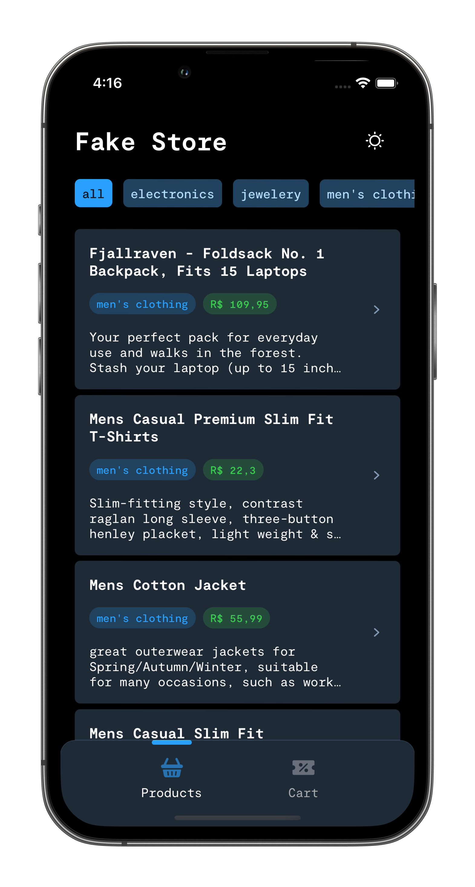
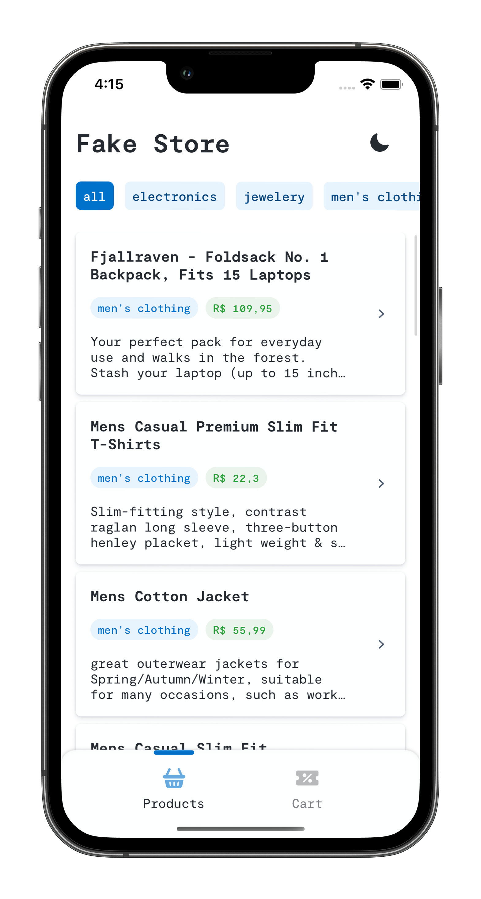

# Fake Store

> A aplicação Fake Store implementa a fake store API, a qual é uma API REST online gratuita que você pode usar sempre que precisar de dados pseudo-reais para seu e-commerce ou site de compras sem executar nenhum código do lado do servidor. É incrível para fins de ensino, códigos de amostra, testes, etc.

[![Swift Version][swift-image]][swift-url]
[![License][license-image]][license-url]

[swift-image]: https://img.shields.io/badge/swift-5.7-orange.svg
[swift-url]: https://www.swift.org/blog/swift-5.7-released/
[license-image]: https://img.shields.io/badge/License-MIT-blue.svg
[license-url]: LICENSE

Essa aplicação tem como objetivo implementar o design pattern MV, consumindo dados da API fake store.

### Screenshots

